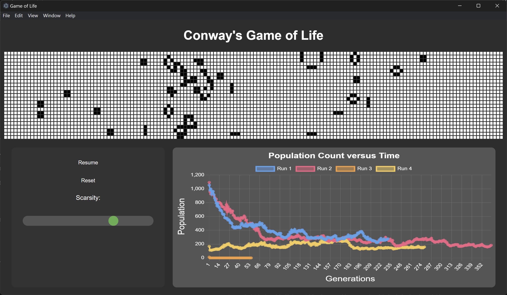

# Conway's Game of Life

## Introduction

This is a basic simulator for Conway's Game of Life, written in JavaScript, with an Electron front end for visualisation. [Conway's Game of Life](https://en.wikipedia.org/wiki/Conway%27s_Game_of_Life) demonstates how complex emergent behaviour can arise from an extremely simple ruleset. 

In the Game of Life, a 2D grid is generated. Each cell holds a binary value, 0 for dead, and 1 for alive. With every new generation, the following rules are applied to each cell to determine if it will survive.

Given the sum of all eight neighbours:

1. **BIRTH** - If dead, and exactly 3 neighbours are alive, a cell becomes alive
2. **SURVIVAL** - If alive, and either 2 or 3 neighbours are alive, a cell remains alive
3. **DEATH** - If alive and more than three neighbours are alive, a cell dies

## Installation
1. Download the latest version of [node.js](https://nodejs.org/en/download).
2. Clone this repository
3. Run ```npm install``` to install necesary packages (electon and chart.js)
4. Run ```npm start``` to run the project.

## Instructions

With each new simulation, the grid will be randomly populated. You can control the sparsity of this random seed with the sparsity slider. Experiment with different initial seeds to see how the population grows!

The simulation can be paused and resumed. When reset, a new random seed is generated, with the sparsity of the slider.

For each simulation, a plot of the population versus generation is made. With each new reset, a new line is added to the chart.



## Contributions

Contributions are welcome! Feel free to fork and make your own changes.